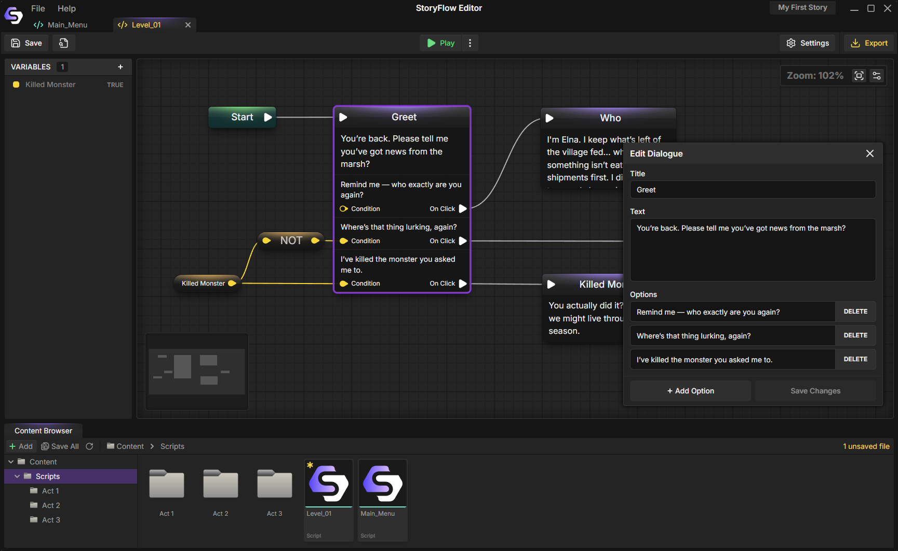

<h1 align="center">
  
  &nbsp;StoryFlow Editor
</h1>

  <a href="https://storyflow-editor.com">Website</a>

---
**StoryFlow Editor** is a desktop app for creating interactive stories through visual logic flows with minimal coding knowledge.

> **Note**: This repository is for public releases only — the source code is currently private.

